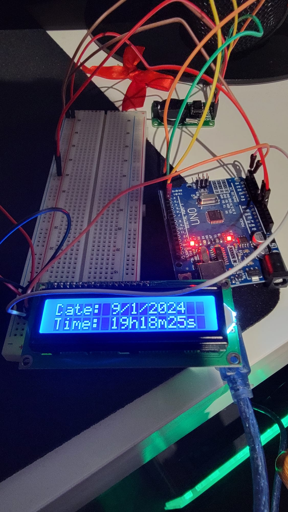

# Arduino Real Time Clock
## Building an Real Time Clock using a RTC Module and an Arduino

In this project I wanted to learn about the usage of a Real Time Clock Module (RTC Module) using arduino. For this simple project I followed some guides online in which all the code and schematics is based off.

The reference used was: https://www.youtube.com/watch?v=MfmK55TREuQ&t=449s&ab_channel=EnjoyMechatronics.

### Table of Contents

1. [Objective](#1-objective)
2. [Electrical Circuit](#2-electrical-circuit)
   1. [Material Needed](#21-material-needed)
        1. [Why do we need a I2C Module?](#211-why-do-we-need-a-i2c-module)
        2. [Why do we need RTC Module to calculate time?](#212-why-do-we-need-rtc-module-to-calculate-time)
   2. [Schematic](#22-schematic)
3. [Code](#3-code)
4. [End Result](#4-end-result)

### 1. Objective

The objective is to use an `Arduino` to receive data about time from a `RTC` (Real Time Clock) Module, and display it using a `LCD I2C` (Liquid Crystal Display) Module.

### 2. Electrical Circuit

#### 2.1 Material Needed

Here it is a list of the material needed:

| Image | Name | Quantity |
| :- | :-: | :-: |
|  | LCD 16x2 Screen | 1
|  | LCM1602 IIC ( I2C Module ) | 1
|  | DS1302 Real Time Clock Module | 1
|  | Arduino Uno R3 | 1
|  | Jumper Wires | 11
|  | Breadboard | 1

_Note that you can use less of some of the components listed above, this is just an example of how to build this circuit._

##### __2.1.1 Why do we need a I2C Module?__

As the [Arduino Guide for LDC I2C 16x2](https://arduinogetstarted.com/tutorials/arduino-lcd-i2c) states, the wiring between the Arduino and the normal LCD is complicated. Therefore we use a I2C Module  to create a __LCD I2C__, composed of a normal LCD, an I2C Module, and a potentiometer. This way we can drastically reduce the amount of pins required, from our Arduino, to control de LCD.

With that being said, it is absolutely possible to do this project without using the I2C Module, it just means that wiring the LCD to the Arduino will be a little more complicated.

##### __2.1.2 Why do we need RTC Module to calculate time?__

First of all, because it's the objective of this project! To experiment with this module! Aside from that, here are, according to [this website](https://history-computer.com/real-time-clock/), the main benefits of a RTC over a software clock:

1. RTCs are more precise than software clocks.
2. The use of an independent power source improves overall power consumption and frequency stability.
3. By using an independent time-keeping module, it frees up resources on the main system for time-critical tasks.

#### 2.2 Schematic

The following image shows how to connect all the components listed above:

This schematic was designed using a software named [Fritzing](https://fritzing.org/download/).

It's possible that the `LCM 1602 IIC I2C Module` is already attached to your `LCD`, but for this schematics we assume both components are separated.
 

For information about the purpose of each pin of the components, I recommend researching in the following links:

* [LCD I2C](https://arduinogetstarted.com/tutorials/arduino-lcd-i2c)
* [SDA and SCL](https://www.circuitbasics.com/basics-of-the-i2c-communication-protocol/)
* [I2C Protocol](https://www.robot-electronics.co.uk/i2c-tutorial#:~:text=SCL%20is%20the%20clock%20line,the%20ground%20or%200%20volts.)
* [RTC DS1302](https://medium.com/@rahuljain13101999/using-ds1302-rtc-module-with-arduino-fdfbcd7a8f13#:~:text=Only%20two%20pins%20(CLK%20and%20DAT)%20are%20required%20for%20interfacing%20with%20Arduino%20other%20than%20VCC%20and%20GND.%20CLK%20and%20DAT%20pins%20are%20actually%20the%20required%20SCL%20and%20SDA%20pins%20for%20the%20I2C%20communication%2C%20while%20RST%20is%20the%20reset%20pin%20(optional).)

### 3. Code

In this project we program an [Arduino](https://www.arduino.cc/en/software) to follow this logic. 
 
For details of the code, go to [`src`](./src/). 
 
The [`main.ino`](./src/main/main.ino) file should be uploaded to the Arduino after the [circuit](#22-schematic) is built.
 
The [`i2c_address_scanner.ino`](./src/i2c_address_scanner/i2c_address_scanner.ino) file can be used to check the address of your `LCD`. For details of why this is important, check this [link](https://lastminuteengineers.com/i2c-lcd-arduino-tutorial/#:~:text=pin%20labeled%20%E2%80%98LED%E2%80%99.-,I2C%20Address%20of%20LCD,-If%20you%20have).

### 4. End Result

After [building the circuit](#2-Electrical-circuit) and [uploading the code to the Arduino](#3-code), the end result should look like this:

In the end I got to use the RTC Module but most of all, learn about it and its purpose. I was a bit skeptical about needing a dedicated component just to keep track of time. Now I know that:

* __It's able to keep track of time, even if I turn off the power supply__, because of the battery that is attached to the RTC component. That may be important for future projects. If some circuit system depends of time schedule to function, being able to "survive" independently from the rest of the circuit may be the reason a system can comeback online from a power shortage.

* __It's able to set daily, monthly and yearly schedules__, important if you want to trigger events in your circuit or program, based on a time schedule. One simple example would be to turn on/off part of a circuit given a certain date and time, maybe to save power. The first example that came to my mind was a parking lot that only charges its customers from 9am to 7pm, so every 9am the machine that sells tickets is turned on, and every 7pm it is turned off.